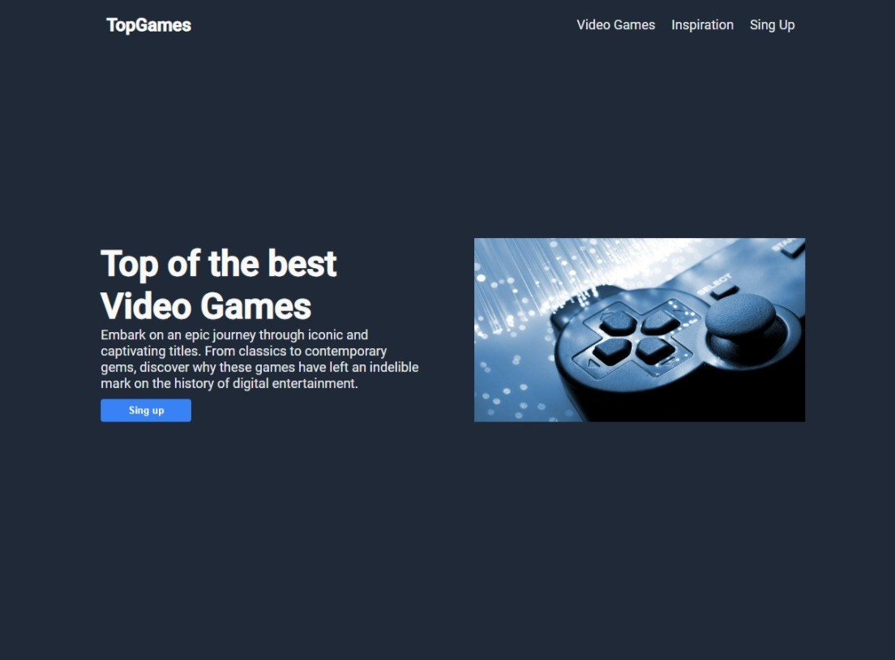

# Landing Page Odin Project

> This page is based on an Odin Project assignment, which involves creating a complete web page from a provided design. In the section, you could customize the content of the images according to your preference. In my case, I chose the theme of video games. The required tools used for this project were HTML, CSS, and Flexbox.

Additional description about the project and its features.

## Built With

- Major languages: HTML, CSS.
- Technologies used: Linux, Git Bash.

## Live Demo

[Live Demo Link](https://vxnec0de.github.io/landing_page_odin_project/)

## Getting Started

**Clone the repository in Git and run it from a browser..**

## Authors

👤 **Vanessa Carolina Rubio Cheing**

- GitHub: [@VxneC0de](https://github.com/VxneC0de)
- Instagram: [@v_rc20](https://www.instagram.com/v_rc20/)
- LinkedIn: [LinkedIn](https://www.linkedin.com/in/vanessa-rubio-7b7492293/)

## 🤝 Contributing

Contributions, issues, and feature requests are welcome!

Feel free to check the [issues page](https://github.com/VxneC0de/landing_page_odin_project/issues).

## Show your support

Give a ⭐️ if you like this project!

## Acknowledgments

- Hat tip to anyone whose code was used: I thank Google for the Information acquired for this project and Microsoft Edge for the images.
- Inspiration: https://www.theodinproject.com/lessons/foundations-landing-page

## 📝 License

This project is [CC0 1.0 Universal](LICENSE) licensed.